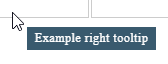

# SimpleTooltip JS

SimpleTooltip.js - простой jquery плагин, который заменяет стандартные подсказки из атрибута title.

Пример:



## Установка

```html
<link rel="stylesheet" href="simple.tooltip.css">
<script src="https://ajax.googleapis.com/ajax/libs/jquery/1.12.4/jquery.min.js"></script>
<script src="simple.tooltip.js"></script>
```

```js
$(function(){
    $('[title]').simpleTooltip();
})
```